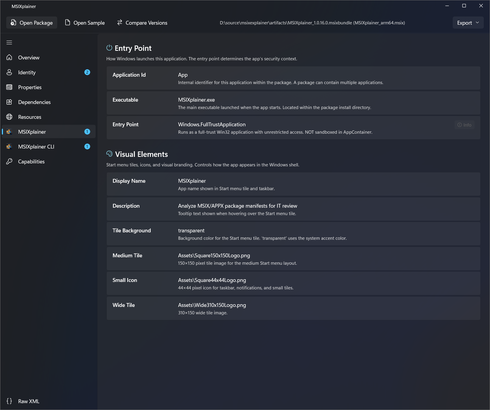
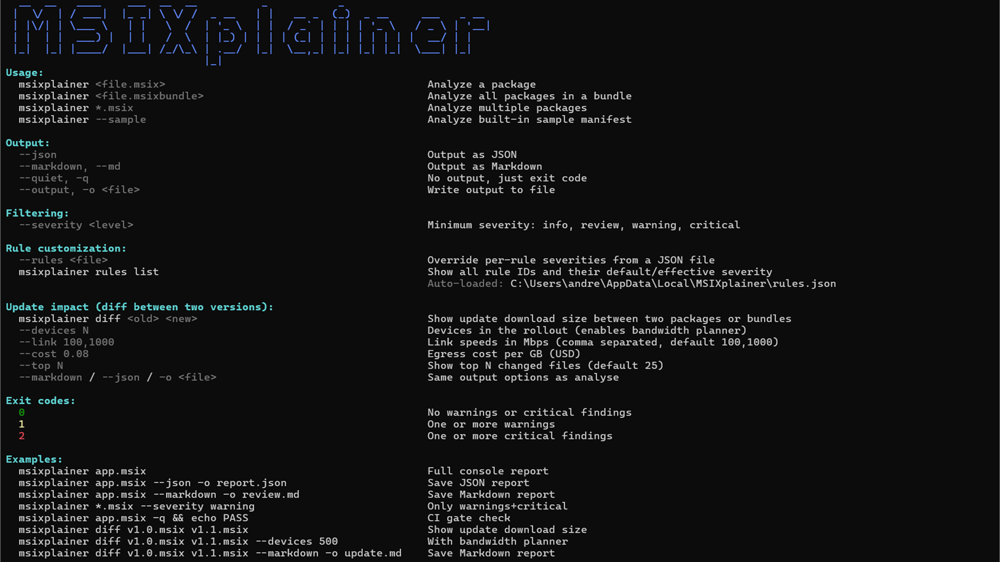

# MSIXplainer

A Windows tool that turns MSIX/AppX package manifests into plain-English IT security reviews. Available as a **WinUI 3 desktop app** and a **CLI tool**.

Instead of reading raw XML, you get categorized findings with severity ratings, explanations of what each manifest entry does, why the app might need it, and what an IT Pro should care about.

[](LICENSE)
[](https://github.com/aclinick/msixplainer/actions/workflows/ci.yml)

---

## Screenshots

| WinUI app | CLI |
|---|---|
|  |  |

---

## What It Does

MSIXplainer is two tools in one:

**1. Manifest review** — opens any `.msix` / `.appx` / `.msixbundle` / `.appxbundle` and turns the manifest into a plain-English security review:

- Categorized findings across **18 security-relevant areas** (trust level, restricted capabilities, virtualization, services, COM, protocols, file associations, background tasks, WebView2, and more)
- Severity tags (`🔴 CRITICAL`, `🟡 WARNING`, `🔵 REVIEW`, `ℹ️ INFO`) and per-rule explanations of *what it does, why an app might need it, and what an IT Pro should care about*
- Tunable severities via a local `rules.json` (CI-friendly)
- Exports to annotated Markdown or structured JSON

**2. Update diff & bandwidth planner** — compares two versions of a package and tells you how much would actually download for an update:

- Byte-exact parity with Microsoft's `comparepackage.exe` (Windows SDK) using `AppxBlockMap.xml` block-hash diffing
- Handles flat packages and `.msixbundle` payloads (per-architecture)
- Fleet rollout estimator: enter device count + link speeds + egress cost and get hours-to-deploy and dollar figures
- Top-N changed files with size deltas, duplicate-file detection
- Exports diff + planner numbers to Markdown or JSON

Everything runs locally. **No cloud service, no LLM, no telemetry, no network calls.** Packages are treated as untrusted input — no code from a package is ever executed.

## Getting Started

### Prerequisites

- Windows 10 version 2004 (build 19041) or later
- [.NET 10 SDK](https://dotnet.microsoft.com/download/dotnet/10.0)
- Windows App SDK 2.0+ (for the WinUI app)

### Build

```powershell
# Clone
git clone https://github.com/aclinick/msixplainer.git
cd msixplainer

# Build everything
dotnet build

# Or build individual projects
dotnet build MSIXplainer.Core
dotnet build MSIXplainer.Cli
dotnet build MSIXplainer
```

### Run the CLI

```powershell
# Analyze a real package
dotnet run --project MSIXplainer.Cli -- path\to\package.msix

# Use the built-in sample manifest (Contoso Collaboration Hub)
dotnet run --project MSIXplainer.Cli -- --sample

# Export to Markdown
dotnet run --project MSIXplainer.Cli -- --sample --markdown --output review.md

# Export to JSON
dotnet run --project MSIXplainer.Cli -- --sample --json

# Filter by severity
dotnet run --project MSIXplainer.Cli -- package.msix --severity warning

# Quiet mode (exit code only — useful for CI)
dotnet run --project MSIXplainer.Cli -- package.msix --quiet

# Analyze multiple packages with glob
dotnet run --project MSIXplainer.Cli -- "C:\packages\*.msix"
```

### Compare Two Packages (update diff)

```powershell
# How much would a v1.0 → v1.1 update actually download?
dotnet run --project MSIXplainer.Cli -- diff old.msix new.msix

# Add a fleet-rollout bandwidth + cost estimate
dotnet run --project MSIXplainer.Cli -- diff old.msix new.msix `
  --devices 5000 --link 100,1000 --cost 0.08

# Export the comparison
dotnet run --project MSIXplainer.Cli -- diff old.msix new.msix --markdown -o update.md
dotnet run --project MSIXplainer.Cli -- diff old.msix new.msix --json -o update.json
```

The diff uses the same block-hash logic as Microsoft's `comparepackage.exe` (Windows SDK), so the byte counts match the SDK tool exactly.

#### CLI Exit Codes

| Code | Meaning |
|------|---------|
| `0`  | No warnings or critical findings |
| `1`  | Warnings found |
| `2`  | Critical findings found |

These exit codes make the CLI usable as a CI/CD gate.

#### Customizing Rule Severities

Every rule emitted by the engine has a stable `RuleId` (e.g. `trust.fullTrust`,
`virt.filesystemDisabled`, `services.windowsService`). You can override the
severity of any rule without changing the rule text by dropping a JSON file at:

```
%LOCALAPPDATA%\MSIXplainer\rules.json
```

Both the CLI and the WinUI app auto-load this file on every analysis. The CLI
also accepts `--rules <file>` to layer an additional override file on top —
useful for checking team-wide rules.json into a repo for CI gating.

Example `rules.json`:

```json
{
  "trust.fullTrust": "Info",
  "services.windowsService": "Warning",
  "capability.broadFileSystemAccess": "Critical"
}
```

Valid severities: `Info`, `Review`, `Warning`, `Critical`. Unknown rule IDs and
unrecognized severity values are skipped with a warning.

To see every available rule ID, its default, and the effective severity after
overrides, run:

```powershell
msixplainer rules list
```

Rule text (Title, Description, WhyItMatters, Recommendation) is intentionally
**not** user-editable — only the severity dial is.

### Run the WinUI App

```powershell
# From the MSIXplainer directory
cd MSIXplainer
.\BuildAndRun.ps1
```

Or open the solution in Visual Studio and run the `MSIXplainer` project.

---

## Project Structure

```
msixplainer/
├── MSIXplainer.Core/                # Shared class library (no UI deps)
│   ├── Models/                      # ManifestFinding, PackageInfo, BlockMapEntry,
│   │                                  BundleInnerPackage, UpdateDiffResult, etc.
│   └── Services/
│       ├── ManifestParserService.cs       # Safe ZIP/XML extraction
│       ├── BundleManifestParser.cs        # .msixbundle / .appxbundle support
│       ├── BlockMapParser.cs              # AppxBlockMap.xml parser
│       ├── RulesEngine.cs                 # 18-rule analysis engine
│       ├── RuleCatalog.cs / RuleSeverityOverrides.cs  # Severity tuning
│       ├── ManifestExplainerService.cs    # Section-by-section explainer
│       ├── ExportService.cs               # Manifest review export (MD + JSON)
│       ├── UpdateDiffService.cs           # SDK-parity update size analysis
│       ├── DiffExportService.cs           # Update diff export (MD + JSON)
│       ├── BandwidthPlannerService.cs     # Fleet rollout estimator
│       └── SampleManifest.cs              # Built-in test manifest
├── MSIXplainer/                     # WinUI 3 desktop app (packaged MSIX)
│   ├── Pages/                       # MainPage, ComparePage, RulesPage
│   ├── ViewModels/                  # MVVM with CommunityToolkit.Mvvm
│   └── Package.appxmanifest
└── MSIXplainer.Cli/                 # Spectre.Console CLI
    └── Program.cs                   # analyze + diff subcommands
```

## Analysis Categories

| Category | What It Checks |
|----------|---------------|
| Identity | Package name, publisher certificate, version |
| Trust Level | Full trust vs. AppContainer sandboxing |
| Restricted Capabilities | `broadFileSystemAccess`, `appDiagnostics`, `runFullTrust`, etc. |
| Standard Capabilities | Internet, removable storage, documents library, etc. |
| Device Access | Microphone, webcam, location, Bluetooth |
| Network Access | Internet, private network, server capabilities |
| Virtualization | Filesystem and registry virtualization bypasses |
| Startup | Auto-start tasks registered at user login |
| Protocols | Custom URI scheme handlers (e.g., `app-name://`) |
| App URI Handlers | Web domain interception |
| File Associations | File type registrations |
| Background Tasks | Push notifications, timers, system event handlers |
| COM Registration | Out-of-process COM servers (Office add-ins, shell extensions) |
| Office Integration | Outlook/Office indicators |
| WebView2 | Embedded browser dependencies |
| VDI | Virtual desktop infrastructure indicators |
| Services | Windows service registrations |
| Elevation | `allowElevation` package extension bypasses |

## Security Model

The tool treats every package as **untrusted input**:

- **No code execution** — packages are opened as ZIP archives, only the manifest XML is read
- **Safe XML parsing** — DTD processing is prohibited, XML resolver is null, entity expansion is capped
- **ZIP bomb guard** — manifest entries larger than 10 MB are rejected; icon extraction capped at 1 MB
- **No elevation** — the tool runs with standard user permissions

## Markdown Export

The Markdown export produces an annotated document similar to a professional security review:

- Section-by-section manifest walkthrough with numbered headings
- XML code blocks for each manifest section
- Explanation tables with severity tags and recommendations
- "How to Read This Document" guide
- Risk assessment callout
- Findings summary table with all findings ranked by severity

## License

[MIT](LICENSE)

